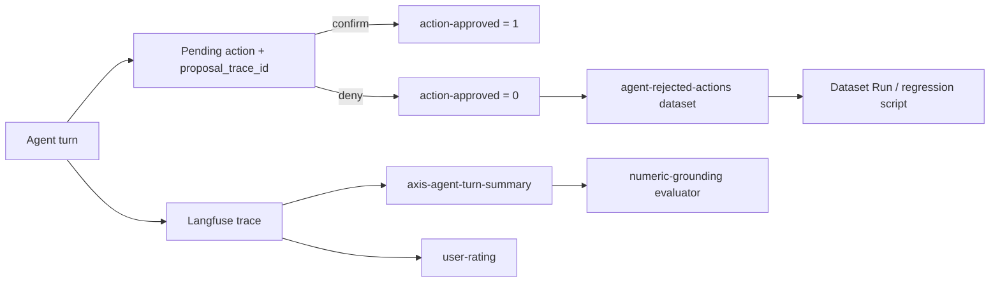

# Observability: PostHog + Langfuse

Two systems, two different questions. Keep them straight:

| | **PostHog** | **Langfuse** |
| --- | --- | --- |
| Answers | What are users doing on the site? | What did the AI agent do, and was it any good? |
| Scope | Pageviews, clicks, funnels, performance, errors, session replay | Agent turns: prompt, tools offered, tool chosen, arguments, results, tokens, cost |
| Project | `Default project` (`492655`), US cloud | US cloud (`LANGFUSE_BASE_URL`) |
| Code | `instrumentation-client.ts`, `src/lib/analytics/` | `src/lib/observability/langfuse.ts` |

> It is **Langfuse**, not LangGraph. LangGraph is an agent-orchestration
> framework and is not used here — the agent loop is a thin custom one
> (`src/lib/agent/loop.ts`). Nothing in this repo depends on LangGraph.

---

## PostHog

### Environment

`NEXT_PUBLIC_POSTHOG_PROJECT_TOKEN` (browser) and `POSTHOG_KEY` (server) are set
in Vercel Production. Browser traffic is proxied through **`/ingest`**
(`next.config.ts` rewrites) so ad-blockers do not silently delete analytics —
never point the browser client straight at `us.i.posthog.com`.

### What is captured, and where the setting lives

Several of these are **project-side settings in the PostHog UI, not code**. A
correct `posthog.init` does nothing if the project has opted out — that is a real
failure mode this project already hit.

| Signal | Event | Controlled by |
| --- | --- | --- |
| Pageviews | `$pageview` | client defaults |
| Page duration | `$pageleave` (`$prev_pageview_duration`) | client defaults |
| Clicks / form submits | `$autocapture` | **project setting** `autocapture_opt_out` |
| Load speed | `$web_vitals` (LCP/INP/CLS/FCP) | **project setting** `autocapture_web_vitals_opt_in` |
| JS errors | `$exception` | `capture_exceptions: true` in `instrumentation-client.ts` |
| Dead / rage clicks | `$dead_click`, `$rageclick` | **project setting** `capture_dead_clicks` |
| Session replay | — | **project setting** `session_recording_opt_in` (30d retention) |

**History worth knowing:** `autocapture_opt_out` was `true` in production until
**2026-08-04**, so exactly **one** `$autocapture` event was recorded in 30 days.
Every "autocapture already covers this" assumption made before that date was
false, and the `data-attr` convention below was inert. Dead clicks were enabled
the same day. Click-derived tiles only have data from that date forward.

### The three layers of instrumentation

Lean on the cheap layers; hand-write an event only when it deserves a funnel.

1. **Autocapture** — every click, pageview, and form submit, no code. Now that
   it is actually on, do not hand-roll a "user clicked X" event.
2. **`data-attr="kebab-name"`** on a meaningful interactive element. The project
   is configured to read `data-attr`, so autocapture records it and you can build
   a clean named Action without a capture call.
3. **Named events** for funnel/conversion moments only:
   - Client intent: `track(event, props)` from `@/lib/analytics/track-client`.
   - Server-confirmed outcome: `track(event, userId, props)` from
     `@/lib/analytics/posthog`, next to the success `return` — never on click.

Rules: `object_action` naming; **reuse existing names** (grep `src/lib/analytics`
and existing `track(` call sites first); **never send PII or secrets** as
properties — ids and enums only.

**Verify project settings:** `POSTHOG_PERSONAL_API_KEY=phx_… npm run posthog:verify`
(checks autocapture, dead clicks, web vitals, replay, and `$identify` volume).

### Dashboards

**[PropLane — Site Health & Dropoff](https://us.posthog.com/project/492655/dashboard/1952875)**
is the operational dashboard. Every tile is HogQL and every one was executed
against real production data before being saved:

| Tile | Reads |
| --- | --- |
| Load speed — Core Web Vitals p75 by page | Slowest routes by p75 LCP / INP / CLS |
| Load speed — LCP p75 trend | Daily p75 LCP, for spotting a regression after a deploy |
| Engagement — active time on page by route | Median / p90 seconds per route |
| Dropoff — where sessions end (exit pages) | Last route per session + exit rate |
| Dropoff — prospect application funnel (ordered) | view → start → submit, strictly ordered |
| Reliability — JS errors per day | `$exception` volume + people affected |
| Frustration — dead clicks & rage clicks by route | The leading indicator before a dropoff |
| AI assistant — usage, trust & satisfaction | Messages, write-action approval rate, thumbs-up rate |

Other dashboards: *PropLane — Key Metrics* (product KPIs), *AI observability
default*, *Analytics basics*.

Two measurement decisions baked into those tiles — keep them if you edit:

- **Page duration is capped at 1800s.** The timer keeps running in a backgrounded
  tab, so uncapped medians reached several hours and measured desk habits rather
  than attention. Excluded views are surfaced as `abandoned_tabs` rather than
  silently dropped.
- **The funnel is strictly ordered** — each step counts only people who did it
  *after* the previous step. An unordered version reported *more* residents than
  submitted applications (114% conversion), which is not a funnel.

### Known gap: `$identify` almost never fires

269 people sent pageviews in 30 days; `$identify` fired **once**.
`posthog.identify(user.id)` is called at every sign-in site
(`portal-auth-form.tsx`, `create-account-client.tsx`, the resident/vendor signup
forms), so the calls exist — but anonymous pre-auth activity is not being
stitched to the account that results.

The practical cost: no funnel can cross the sign-up boundary. That is exactly why
the prospect funnel above stops at "Submitted an application" instead of ending at
`resident_account_created` — the resident is a different, unlinked person to
PostHog. Fix the stitching before trusting any cross-auth conversion number.

---

## Langfuse

### What is traced

Every agent turn on every portal surface, via `src/lib/observability/langfuse.ts`:

- `traceAgentTurn` — one trace per turn, carrying `userId`, `sessionId`, actor
  metadata (`landlordId`, role), and **prompt identity** (`promptId`,
  `promptHash`, `release`). Nested inside it:
  - one **generation** per LLM call — model, prompt, output, per-call token
    counts, estimated cost, tools chosen, `iteration`, `stopReason`;
  - one **span** per tool call — full arguments and result, `ok`;
  - one **span** per proposed write action;
  - one **`axis-agent-turn-summary`** span when the turn had successful tool
    evidence — packs `{ userRequest, toolEvidence }` as input and the final
    reply as output so a managed observation evaluator can judge grounding
    without reading sibling spans.
- `traceAgentAction` — the confirm/cancel of a gated write action, linked back
  to the proposal via `proposalTraceId` when available.
- `tracePublicToolTurn` — anonymous public surfaces (marketing housing search),
  session-scoped, no user id to carry.

Everything degrades to a no-op when `LANGFUSE_PUBLIC_KEY` / `LANGFUSE_SECRET_KEY`
are unset, **and under `NODE_ENV=test`** (so Vitest / CI never pollute the
production project). **Tracing must never break a turn** — keep new code inside
the `safe()` wrapper. Traces are tagged with environment
(`VERCEL_ENV` / `LANGFUSE_TRACING_ENVIRONMENT`).

### Prompt versioning

Prompts stay repo-owned. `src/lib/agent/system-prompts.ts` is the assembled
catalog and applies the shared standing response policy to every conversational
surface; the adjacent `*-system-prompt.ts` files hold detailed role/tool
instructions. Each turn stamps:

| Field | Meaning |
| --- | --- |
| `promptId` | Stable surface id (`manager-assistant`, `resident-assistant`, …) |
| `promptHash` | SHA-256 of the exact system string the model received |
| `release` | `VERCEL_GIT_COMMIT_SHA` (or `AXIS_RELEASE_SHA` / `local`) |

When quality drops, group traces by `promptHash` / `release` to see whether a
prompt edit or a deploy caused it. The hash covers the exact assembled prompt,
including any user custom-instruction block. This is **not** Langfuse Prompt
Management.

### Scores (the quality series)

| Score | Source | Value | Filter for failures |
| --- | --- | --- | --- |
| `user-rating` | Thumbs on the assistant reply | 1 / 0 | `user-rating = 0` |
| `action-approved` | User confirmed / denied a gated write | 1 / 0 | `action-approved = 0` |
| `numeric-grounding` | Managed LLM-as-judge on `axis-agent-turn-summary` | 1 / 0 | `numeric-grounding = 0` |

**`action-approved` is the dense label.** Every gated write is shown to a human;
confirm → 1, deny → 0, scored on the **proposal** trace (never a client-supplied
id). The `proposal_trace_id` column on `agent_pending_actions` is the join.
Tour proposals with no chat turn leave it null and skip scoring.

**Use one score name per question.** Add a new name only for a genuinely
different question, never a per-surface variant.

### The self-improving loop



1. `traceAgentTurn` hands the route its trace id via `opts.onTraceId` (manager,
   resident, and vendor chat all wire this).
2. The chat route returns `traceId`, persists it in `agent_messages.tool_trace`,
   and — when a write is proposed — stores it as `proposal_trace_id` on the
   pending-action row.
3. Confirm / deny scores `action-approved` on that proposal trace and records an
   `axis-agent-action` audit trace (`decision: confirm|cancel`).
4. Thumbs (👍/👎) still go through `POST /api/agent/feedback` → `user-rating`
   after an ownership check (`tests/unit/agent-feedback-route.test.ts`).
5. `npm run langfuse:sync-eval-dataset` upserts denied proposals into the
   Langfuse dataset `agent-rejected-actions` (idempotent id `eval-{traceId}`).
6. `npm run langfuse:run-regression` registers a Dataset Run. Default mode is a
   schema/fixture check; `--live` agent replay needs a sealed mock context and
   is not enabled yet. **A pass means we avoided the same mistake — not that the
   new answer is correct.**
7. The managed **numeric-grounding** evaluator runs at 100% on
   `axis-agent-turn-summary` observations in production. Configure it once with
   `npm run langfuse:setup` (prints the judge prompt + mapping).

### Loop health

`npm run langfuse:agent-health-report` pulls the last N days and prints:

- averages for `action-approved`, `numeric-grounding`, `user-rating`
- max-iteration rate and termination reasons from turn summaries
- tool failure counts (`ok=false`) ranked by tool

Useful Langfuse UI filters:

- Observations named `axis-agent-turn-summary`
- Scores `action-approved = 0` (denied proposals)
- Metadata `terminationReason = max_iterations`
- Tool spans with `metadata.ok = false`

Dashboard shell: **Agent improvement loop** (created by `langfuse:setup`).
Widgets are easiest to finish in the Langfuse UI; the health-report script is the
portable, checked-in fallback.

### Ops commands

| Command | Purpose |
| --- | --- |
| `npm run langfuse:setup` | Ensure dataset, Anthropic connection, evaluator, rule, dashboard |
| `npm run langfuse:verify` | Live smoke: synthetic denial score + dataset item + active rule |
| `npm run langfuse:sync-eval-dataset` | Upsert denied proposals into the dataset |
| `npm run langfuse:run-regression` | Dataset Run / anti-regression check |
| `npm run langfuse:agent-health-report` | Markdown (or `--json`) health snapshot |

Pull Production keys transiently (do not commit):

```bash
vercel env pull --environment=production --yes /tmp/axis-langfuse.env
set -a; source /tmp/axis-langfuse.env; set +a
npm run langfuse:setup
rm -f /tmp/axis-langfuse.env
```

### Watch out: test traffic pollutes production traces

Historically, 115/141 traces used synthetic ids (`user_a`, `manager_a`). The
client now **refuses to initialize under `NODE_ENV=test`**. Still filter on real
uuid `userId`s when reading historical data, and prefer a separate Langfuse
project for any harness that must emit traces.

---

## Adding a new signal

- **A user-facing interaction?** Add `data-attr` and stop. Autocapture has it.
- **A funnel/conversion moment?** One `track()` call, `object_action` name,
  reuse an existing name if one fits, no PII.
- **A new agent capability?** Nothing to do — `runAgentTurn` traces every tool
  automatically through the observer.
- **A new agent surface?** Pass `onTraceId` through, return `traceId`, stamp
  `resolvePromptMeta(...)`, and persist `proposalTraceId` on pending actions —
  or that surface silently loses ratings and approval scores.
